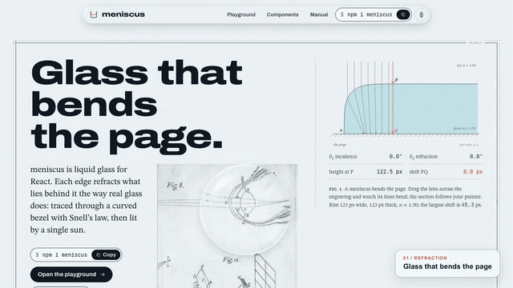

# meniscus workspace

Liquid glass for React, refracted by optics. The library lives in [`packages/meniscus`](packages/meniscus) and is [published on npm](https://www.npmjs.com/package/meniscus). The demo site, playground and manual live in [`apps/site`](apps/site).

[](docs/media/meniscus-demo.mp4)

[Watch the full 30-second demo](docs/media/meniscus-demo.mp4) — drag a lens across Newton's engraving, tune its optical layers, compare finished interfaces with glass on and off, then see the React example.

[](https://thanhphuchuynh.github.io/meniscus/#try-online)

[Run the editable example](examples/optics) — refractive index, RGB splitting and lighting controls, using the published npm package. Choose **Edit in StackBlitz** on the site to open it without installing anything.

[Changelog](CHANGELOG.md) · [Release process](RELEASING.md)

[Live site and manual](https://thanhphuchuynh.github.io/meniscus/) · [Manual](https://thanhphuchuynh.github.io/meniscus/docs/)

```sh
pnpm install
pnpm dev        # demo site at http://localhost:5173
pnpm test       # optics and component tests
pnpm build      # library, then site
```

With the development server running, `pnpm --filter site test:browser` checks lens motion, layered GPU rendering, comparisons, touch input and reduced motion in Chromium. Install its browser once with `pnpm exec playwright install chromium`. Set `MENISCUS_CAPTURE=1` to save desktop/mobile screenshots to your system’s temporary directory.

The demo reproduces two plates from Isaac Newton's *Opticks* (London, 1704): Book I, Plates II and IV, public domain, scanned by the [Internet Archive](https://archive.org/details/optickstreatise00newta) and duotoned for the site.

The original project code and documentation are [MIT licensed](LICENSE). The site's bundled fonts and JavaScript dependencies retain their own licenses, listed in the [third-party notices](apps/site/public/THIRD_PARTY_NOTICES.txt). The demo's [privacy note](apps/site/public/PRIVACY.txt) describes its local theme preference and current data use.
